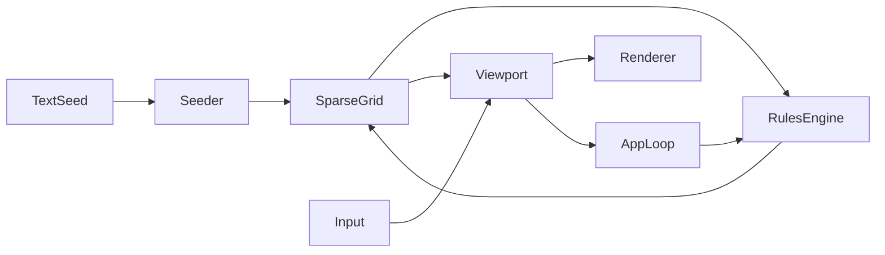

# Non-Matrix Phase 1 Architecture and Build Plan

## 1. Scope and Constraints

- Runtime: Python 3.11
- Package layout: `src` style package under `src/non_matrix`
- Dependency management: `uv`
- Rendering: `pygame`
- Testing: `pytest`
- Cell topology: 8-neighbor Moore neighborhood
- State model: integer state, constrained to Phase 1 alive/dead semantics, designed to expand to bitfield behavior

## 2. Phase 1 System Boundaries

### In Scope

- Sparse engine core with dynamic coordinate growth
- Conway Game of Life over sparse frontier evaluation
- Deterministic text-to-pattern seeding
- Pygame viewport with pan, zoom, and click-to-seed
- Basic activity heat accounting and render overlay hook

### Out of Scope for Phase 1

- Hashlife memoization engine
- Distributed/multi-process execution
- Learning or adaptive rule search
- Production persistence formats

## 3. Proposed Module Structure

```text
.
├─ pyproject.toml
├─ README.md
├─ src/
│  └─ non_matrix/
│     ├─ __init__.py
│     ├─ cell.py
│     ├─ sparse_grid.py
│     ├─ rules.py
│     ├─ seeding.py
│     ├─ simulation.py
│     ├─ viewport.py
│     └─ app.py
└─ tests/
   ├─ test_cell.py
   ├─ test_sparse_grid.py
   ├─ test_rules_life.py
   ├─ test_seeding.py
   └─ test_simulation_step.py
```

## 4. Core Data Model Design

### 4.1 Cell Model

`Cell` responsibilities:

- Hold compact integer state in `value`
- Store stable coordinate `(x, y)`
- Store optional `parent` coordinate for root visualization
- Provide helpers to evaluate alive/dead in Phase 1

Recommended fields:

- `x: int`
- `y: int`
- `value: int` where `0` means inactive and `1` means active for Life mode
- `parent: tuple[int, int] | None`
- `last_touched_tick: int` for activity/heat tracking

Recommended API:

- `is_alive() -> bool`
- `set_alive(flag: bool) -> None`
- `set_bits(mask: int) -> None` for forward compatibility

### 4.2 Sparse Grid Model

`SparseGrid` storage:

- `cells: dict[tuple[int, int], Cell]`
- Optional `active_coords: set[tuple[int, int]]` cache for fast stepping
- Optional `tick: int`

Growth rule:

- Reading a neighbor does not allocate
- Writing activation to missing coord allocates immediately
- Deactivation can prune the cell from dictionary to preserve sparsity

Recommended API:

- `get(coord) -> Cell | None`
- `ensure(coord, parent=None) -> Cell`
- `activate(coord, parent=None) -> Cell`
- `deactivate(coord) -> None`
- `alive_neighbors(coord) -> int`
- `iter_alive() -> iterator[Cell]`

## 5. Sparse Game of Life Engine

Step algorithm over sparse frontier:

1. Build `candidates` from all alive cells plus all of their neighbors
2. For each candidate coord, compute alive neighbor count
3. Apply Conway rules using integer and bitwise-safe operations
4. Build next alive set
5. Diff current and next sets to activate/deactivate coords
6. Increment tick and touch counters

Bitwise-compatible decision expression:

- Let `a` = current alive bit (0/1)
- Let `n2` = `1` if neighbors == 2 else `0`
- Let `n3` = `1` if neighbors == 3 else `0`
- Next = `(a & n2) | n3`

This keeps core transition representation aligned with future bitfield rule processors.

## 6. Text-to-Pattern Seeding

Deterministic seeding pipeline:

1. Encode input string with ASCII bytes
2. Place one byte per row near an origin
3. Expand each byte into 8 bits left-to-right
4. Activate a cell for each `1` bit
5. Assign parent links to previous active bit in scan order (or previous row anchor)

Determinism guarantees:

- Same text + same origin + same orientation produces identical coordinate set
- Empty string produces no activation
- Non-ASCII policy for Phase 1: strict ASCII and raise clear error

## 7. Pygame Viewport and Rendering Layers

### Interaction

- Pan: mouse drag updates camera offset
- Zoom: mouse wheel updates scalar with clamped range
- Seed click: left-click world coordinate activates a local seed or single root node

### Render Layers

1. Background grid (optional)
2. Connection lines from cell to parent (subtle alpha)
3. Active cells (bright blocks)
4. Heat overlay using per-cell recent touch intensity
5. HUD text for tick, alive count, zoom

Coordinate transforms to isolate in `viewport.py`:

- `screen_to_world`
- `world_to_screen`

## 8. Test Strategy with Pytest

Unit tests:

- `Cell` alive/dead helpers and bit-set behavior
- `SparseGrid` ensure, activate, deactivate, and pruning
- Neighbor counts on sparse edge cases

Rule tests:

- Still life block remains stable
- Blinker oscillates with period 2
- Lone cell dies

Seeding tests:

- `Hi` produces deterministic coordinates
- Repeated calls with same origin are identical
- Non-ASCII input raises expected error

Simulation tests:

- One step mutates only candidate frontier
- Tick increments and activity marks are updated

## 9. Environment and Build Scaffolding with uv

`pyproject.toml` plan:

- Project metadata for `non-matrix`
- `requires-python = ">=3.11"`
- Dependencies: `pygame`
- Dev dependencies group: `pytest`
- Optional script entry point: `non-matrix = non_matrix.app:main`

Local setup flow for implementation mode:

1. Initialize project metadata
2. Add runtime dependency `pygame`
3. Add dev dependency `pytest`
4. Create `src` and `tests` trees
5. Run `pytest`

## 10. Handoff Sequence for Code Mode

1. Create package skeleton and `pyproject.toml`
2. Implement `cell.py`
3. Implement `sparse_grid.py`
4. Implement Life rule stepping in `rules.py` and/or `simulation.py`
5. Implement ASCII seeding in `seeding.py`
6. Implement viewport transforms and renderer in `viewport.py`
7. Wire event loop and simulation control in `app.py`
8. Add tests in `tests/`
9. Execute test suite and resolve failures

## 11. Mermaid Architecture Sketch



